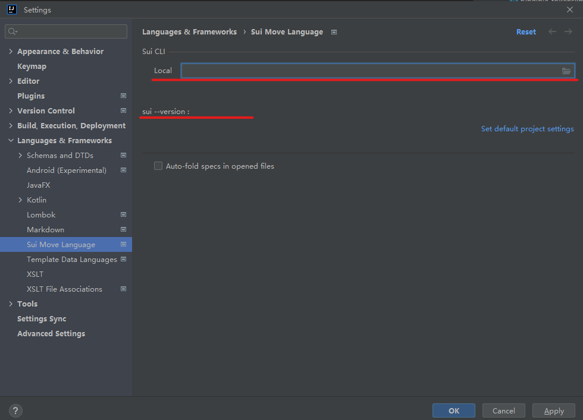
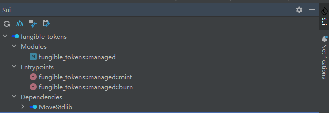
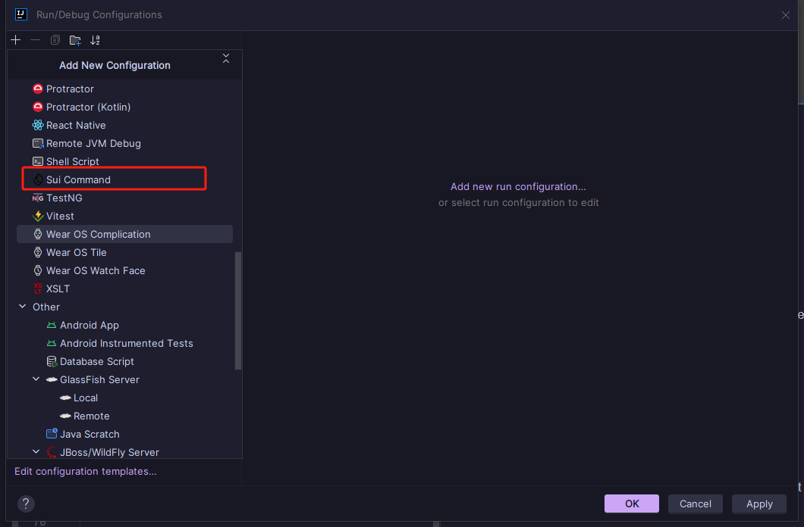
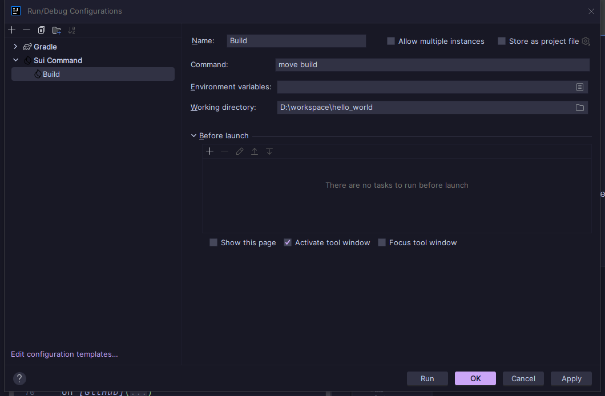

# Sui Move Language plugin for the Intellij platform

[中文](./README.zh_CN.md)

## Installation

### Online

Open in your IDE, search for _Sui Move Language_ and install the plugin.
`Settings > Plugins > Marketplace`
s

### Local

[install file](./resources/intellij-sui-move-1.0.0.223.zip)

## Features

* Syntax highlighting
* Code formatting
* Go-to-definition
* Type inference
* Execute custom command
* Some quick buttons
* `sui` binary integration

## Dependencies

For git dependencies specified in `Move.toml` file you need to manually run `move package build` to populate `build/`
directory.

## Compatible IDEs

All Intellij-based IDEs starting from version 2022.3.

## Usage

### Set the Sui Cli Path

Open `Settings > Languages&Frameworks > Sui Move Language`,click file select and select the valid sui cli path.
Then the version label will show the version of the sui cli.

### Using the ToolWindow

The plugin features a dedicated ToolWindow with the following functionalities:

- Refresh Project:

   : synchronize the latest state of your project.

- Get Active Address:

   : displays the current active address information.

- Switch Account:

   : to switch between different accounts.

- Switch Network:

   : allows switching between different network environments, such as from a
  development network
  to a test network.

### Execute custom command:

Click on `Edit Configurations` in the toolbar to configure custom commands. Click on the `+` in the top left corner,
find `Sui Command`, and click to add a custom command.

In the configuration panel, you can set the name and command. After saving, you can click
the  button in the
toolbar to execute the command.

> Note: Please make sure that the working directory is located in the current project directory.

## Notes

Ensure the project is correctly set up before using the plugin features.
The functionality of the plugin depends on the current state of the project, so keep it up-to-date.

## Getting Help

For any issues encountered while using the plugin, please open an issue
on [GitHub](http://github.com/moveFuns/intellij-move)
